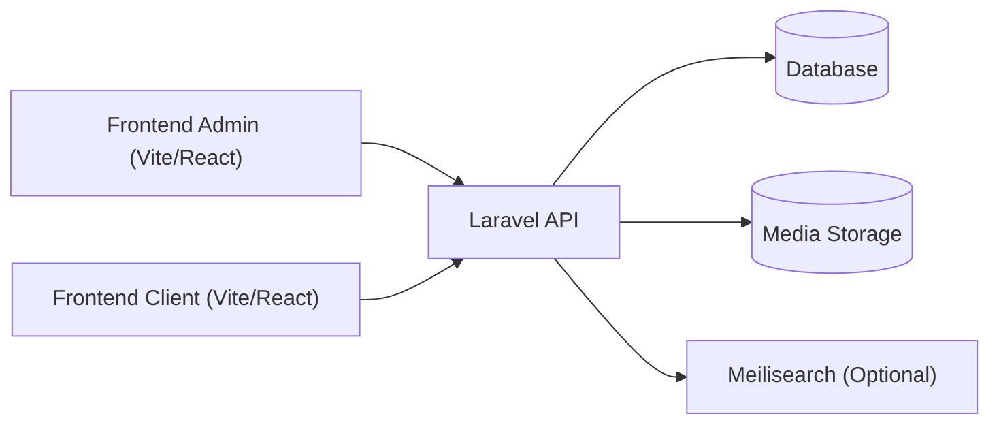

# CoverRest LB

CoverRest LB is a full-stack e-commerce platform built with a Laravel API and two Vite/React applications: a private admin dashboard and a public customer storefront. The system supports end-to-end retail operations, from catalog management and promotions to checkout, fulfillment, and returns.

## Product Scope
- Catalog management (products, variants, categories, brands, tags, media)
- Inventory, pricing, and promotion control
- Order lifecycle, including pre-orders and returns
- Customer accounts, addresses, wishlist, and order history
- Storefront content sections and home page merchandising

## Primary User Journeys
- Customers browse, search, view products, add to cart, and checkout
- Customers manage profiles, addresses, orders, pre-orders, and wishlists
- Admins create and maintain catalog items and content
- Admins manage inventory, pricing, coupons, and promotions
- Admins process orders, returns, and customer requests

## Architecture Overview
The Laravel API is the single source of truth for business rules and data. Both frontends authenticate against the same API and consume shared catalog and order endpoints. Media is served by the backend, and search can be powered by Meilisearch when enabled.

## Tech Stack
- Backend: Laravel (PHP)
- Frontend: React + Vite + TypeScript
- State and data: Redux Toolkit, React Query, Axios
- Styling and UI: Tailwind CSS, Radix UI
- Search (optional): Meilisearch

## Repository Layout
- `backend/` Laravel API, business logic, database, and integrations
- `frontend/admin/` Admin dashboard (catalog, orders, customers, settings)
- `frontend/client/` Customer storefront (shop, cart, checkout, profile)

## Local Setup (Short)
Backend:
1. `cd backend`
2. `composer install`
3. Copy `.env.example` to `.env` and set database credentials
4. `php artisan key:generate`
5. `php artisan migrate`
6. `php artisan serve`

Admin app:
1. `cd frontend/admin`
2. `npm install`
3. `npm run dev`

Client app:
1. `cd frontend/client`
2. `npm install`
3. `npm run dev`

## Environment & Secrets
- Use `backend/.env.example` as the backend template.
- Use `frontend/admin/.env.example` and `frontend/client/.env.example` as frontend templates.

## Deployment (High Level)
- Deploy the Laravel API with a production database and media storage
- Build and host the admin and client apps as static sites
- Set production API base URLs in each frontend `.env` file
- Enable Meilisearch for faster catalog search when required